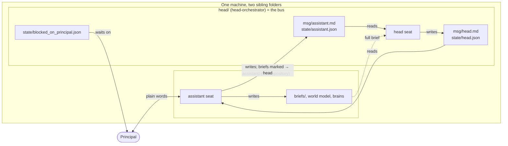

# assistant-layer

**A deployable template for an executive-assistant agent seat** — the seat that works directly with a
person, works out what they actually want, keeps track of everything in motion, and hands real work
to a head orchestrator as written briefs.

It is one half of a pair. The other half is
**the companion [`head-orchestrator`](https://github.com/Matt28296/head-orchestrator) template**, which
is also the shared bus.

**→ Start with [SETUP.md](SETUP.md).**

---

## ⚠ Do not fork this repository

**A GitHub fork of a public repository stays public.** A deployed copy will hold a real person's
priorities and a real business's state. Use **Use this template → Private** under the account of the
person the system works for.

---

## How the two seats work together



Each seat writes only what its row in the head's `IDENTITY.md` allows, and commits only its own paths.
The operator who installs the system is not a principal and approves nothing on the principal's behalf.

---

## What is in here

```
CLAUDE.md                     the assistant seat's charter      (placeholders: double-braced NAMES)
SETUP.md                      step-by-step install, with the steps only the principal may do marked
HANDOFF.md                    where things stand, for the next session
CONTINUITY.md / RESTART.md    what survives a restart, and how to bring each part back
state/WORLD-MODEL.md          priorities, projects, blockers
state/AGENT-REGISTRY.md       who is actually alive — measured, not claimed
principal-mind/               how the principal decides: confirmed/ vs inferred/, review queue
system-brain/                 how the system works
briefs/                       Execution Brief template
reports/                      outcome summaries
tools/                        launcher + placeholder filler that refuses to say OK early
tests/                        offline checks for the filler and the templates
.github/workflows/            runs those checks on Windows and macOS, in this public template only
examples/                     a fictional filled install, to show what the filler produces
values.example.json           the values to fill in
docs/                         how and why it works: charter, authority, bus protocol, 21 laws
CHANGELOG.md                  what changed since publication
```

**Nothing here is specific to any person or business.** Every personal value is a double-braced placeholder,
filled on the target machine.

## Read first

- **[docs/LAWS.md](docs/LAWS.md)** — the failure modes this structure exists to prevent
- **[docs/AUTHORITY.md](docs/AUTHORITY.md)** — levels, hard lines, and why identity is never delegated
- **[docs/CHARTER.md](docs/CHARTER.md)** — the full reasoning behind the assistant role

---

## Where it comes from

The doctrine in `docs/` comes from a multi-agent system run by one person, where independent agent
sessions on several machines coordinate through a git repository and operate under explicit written
authority boundaries. It was written after running that system, not before. This template is its
smallest working form: two seats on one machine.

## What this is not

- **Not a framework or a library.** It is documents, state files and a few small scripts, copied
  and filled once per install.
- **Not the operation itself.** None of its people, clients, accounts, campaign data, figures, machine
  names or credentials appear in these files. They were built by allowlist — written fresh rather than
  copied and cleaned — so that nothing unvetted had to be scrubbed out of them.
- **Not the knowledge vaults.** `principal-mind/` and `system-brain/` here are empty skeletons, and
  `docs/brains/` describes how vaults are *structured and maintained*. The real contents are a model of
  a specific person's judgement and a specific operation's private state, and are not published.

## The four ideas worth taking away

**1. A declared cadence is a claim until it is measured.**
An agent is active when a round-trip has been observed *and* its heartbeat is fresh — never because
it says so. Self-reports and authorship metadata are labels, not credentials.

**2. Guards fail in the reassuring direction, and those are the ones that survive.**
A check that can report healthy while its subject is dead eventually will, and nobody files a bug
about good news. The mirror image is just as expensive: a guard that fails *loudly* into a channel
with no reader is worth exactly the same. **An alarm needs an actuator.**

**3. Authority is delegable. Verification is not.**
When a principal delegates decision-making, the right to decide moves and the requirement for
evidence does not. Taking someone's word on authority is not taking their word on facts.

**4. On a machine a human uses, an agent's polling loop is not free.**
It costs the human. Poll a file, not a process.

## Why it is public

The operating structure is the transferable part. The failure modes in `docs/LAWS.md` were expensive
to find and are not specific to this operation — most of them are shapes that any system of
independent agents writing to shared state will eventually produce.

Corrections are welcome. Claims that turn out to be wrong get marked wrong and kept, with the
correction, rather than deleted — that is the same rule the vaults run on.
